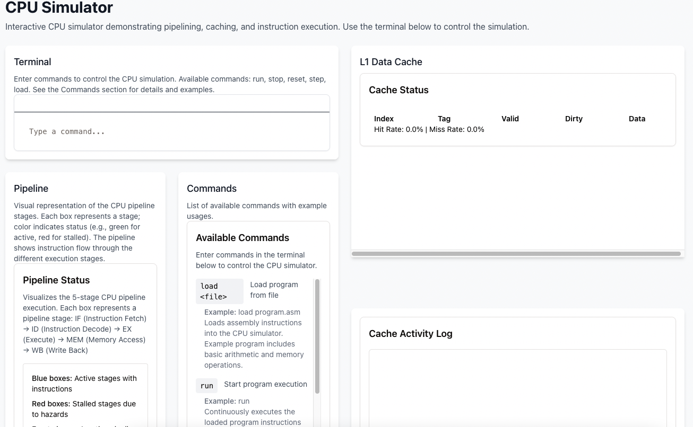

# Command line CPU simulator



A modern full-stack application built with Express, React, and PostgreSQL, featuring authentication, real-time updates, and a CPU simulator interface.

## Tech Stack

- **Frontend**: React with TypeScript, Vite, TailwindCSS, and Shadcn/UI components
- **Backend**: Express.js with TypeScript
- **Database**: PostgreSQL with Drizzle ORM
- **Authentication**: Passport.js with local strategy
- **Real-time**: WebSocket support

## Project Structure

```
├── client/          # React frontend
├── server/          # Express backend
├── db/              # Database schema and configuration
└── public/          # Static assets
```

## Key Features

- Modern TypeScript setup for both frontend and backend
- Database integration with Drizzle ORM
- User authentication system
- Real-time WebSocket capabilities
- Interactive CPU simulator interface
- Development hot-reloading
- Production-ready build system

## Getting Started

1. The application runs on port 5000 by default
2. Development mode: `npm run dev`
3. Production build: `npm run build`
4. Production start: `npm run start`

## Database Schema

Currently includes:
- Users table with username and password fields
- Extensible schema system using Drizzle ORM

## Development

The development server provides:
- Hot module replacement
- TypeScript checking
- Runtime error overlay
- Automatic API routing
- Database migrations with `npm run db:push`

## Production Deployment

The application is configured for deployment on Replit with:
- Automated build process
- Production optimizations
- Database connection management
- Static file serving

## Environment Variables

Required environment variables:
- `DATABASE_URL`: PostgreSQL connection string
- `NODE_ENV`: Application environment ('development' or 'production')

## License

MIT License
